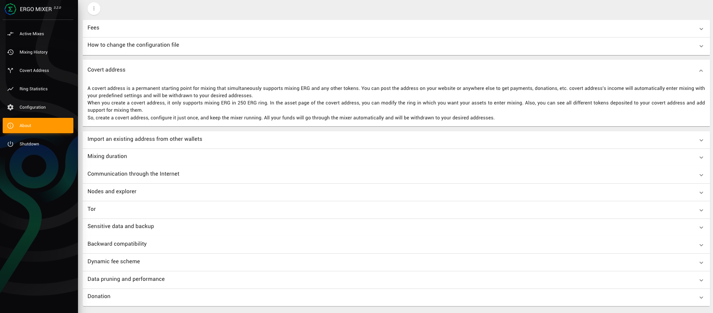
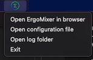

<!-- PROJECT LOGO -->
<br />
<p align="center">
  <a href="https://github.com/ergoMixer/ergoMixBack/">
    
  </a>
<!--   <h3 align="center">Calamity</h3>O -->


  <p align="center">
   Ergo Mixer
    <br />
    <a href="https://github.com/ergoMixer/ergoMixBack/wiki"><strong>Explore the docs »</strong></a>
    <br />
    <br />
    <a href="#video-tutorial">View Demos</a>
    ·
    <a href="https://github.com/ergoMixer/ergoMixBack/issues">Report Bug</a>
    ·
    <a href="https://github.com/ergoMixer/ergoMixBack/issues">Request Feature</a>
  </p>
</p>


<!-- TABLE OF CONTENTS -->
<details open="open">
  <summary><h2 style="display: inline-block">Table of Contents</h2></summary>
  <ol>
    <li>
      <a href="#about-the-project">About The Project</a>
    </li>
    <li>
      <a href="#getting-started">Getting Started</a>
      <ul>
        <li><a href="#prerequisites">Prerequisites</a></li>
        <li><a href="#installation">Installation</a></li>
      </ul>
    </li>
    <li><a href="#usage">Usage</a></li>
    <li>
      <a href="#notes">Notes</a>
      <ul>
        <li><a href="#stealth-address">Stealth Address</a></li>
        <li><a href="#breaking-change">Breaking Change</a></li>
      </ul>
    </li>
    <li><a href="#roadmap">Roadmap</a></li>
    <li><a href="#contributing">Contributing</a></li>
    <li><a href="#license">License</a></li>
    <li><a href="https://discord.gg/MP7uajEmpP">Contact</a></li>
    <li><a href="#acknowledgements">Acknowledgements</a></li>
  </ol>
</details>


<!-- ABOUT THE PROJECT -->
## About The Project

ErgoMixer is a web application for mixing ergs and tokens based on Ergo platform. ErgoMixer is completely serverless; It only needs to connect to the explorer and a node (any node! no api_key is needed). For more information on how it works see [here](https://github.com/ergoMixer/ergoMixBack/wiki/How-it-works-ergoMixer).




<!-- GETTING STARTED -->
## Getting Started

To get the Mixer up and running you have a few options:

1. <a href="#quick-start-shell-script">Quick Start Shell Script</a> - Build from source or run the latest jar. (UNIX systems)
2. <a href="#docker-quick-start">Docker Quick Start</a>
3. <a href="#run-mixer">Download the latest `.jar`</a>
4. <a href="#manual-installation">Build from source</a>


<!-- USAGE EXAMPLES -->
## Usage

When you open the Mixer, the home page displays information about the system and how each component works. There will also be a ErgoMixer dropdown available from your menu bar when running. 



## Video Tutorial
  * [ErgoMixer Tutorial Installation - Windows, Mac, JVM & Docker - Version 3.0.1 & Above](https://www.youtube.com/watch?v=iIHLlIZ-47Q)
  * [ErgoMixer Tutorial Usage - Taking Fire - Version 3.0.1 & Above](https://www.youtube.com/watch?v=Cc3n8CjaGPE)


## Installation
### Quick Start Shell Script

Open your favourite terminal and enter the following to build from source or download and run the latest `.jar`:

```
wget https://raw.githubusercontent.com/ergoMixer/ergoMixBack/master/sh/install.sh
chmod +x install.sh
./install.sh
```

If you encounter any permission errors when attempting to run the script, please run `chmod +x install.sh` from within the same directory. 

### Docker Quick Start

To run the ErgoMixer with default config (A Node and Explorer in Mainnet network) use:
```shell
$ docker run -p 127.0.0.1:9000:9000 \
    --restart=always \
    -v /path/on/host/to/ergo/database_and_logfile:/home/ergo/ergoMixer \
    -d ergomixer/mixer:latest 
```

To run the ErgoMixer with a custom config file use:
```shell
$ docker run -p 127.0.0.1:9000:9000 \
    --restart=always \
    -v /path/on/host/to/ergo/database_and_logfile:/home/ergo/ergoMixer \
    -v <path-your-config-file>/yourConfig.conf:/home/ergo/mixer/application.conf \
    -d ergomixer/mixer:latest 
```

The database and log file will be in your host directory `/path/on/host/to/ergo/database_and_logfile` ; you can use `9000` port locally to load the mixer.

NOTE: The `/path/on/host/to/ergo/database_and_logfile` directory must have `777` permission or have owner/group numeric id equal to `9052` to be writable by the container.


<!-- MANUAL -->
### Manual Installation
 ### Prerequisites 
  * #### OpenJDK 8
    Install an appropriate version of OpenJDK 8 from [Here](https://jdk.java.net/java-se-ri/8-MR3) based on your OS.
  * #### SBT 1.2.7
    Depending on your OS, you can follow instructions in [this](https://www.scala-sbt.org/1.0/docs/Setup.html) page to install sbt.

### Build the ErgoMixer:
  * #### Frontend
      Use the following command to get the latest frontend:
      ```shell
      $ git submodule update --init
      ```
      Then build the `ergomixfront` by following [these](https://github.com/ergoMixer/ergoMixFront/blob/master/README.md) instructions.
      
      Then, use the built front in the backend by using the following command in `ergomixback` directory:
      ```shell
      $ mv ergomixfront/build/ mixer/public
      ```
  * #### Backend      
    Finally, build the backend:
    ```shell
    $ cd ./mixer
    $ sbt assembly
    ```
    The jar file will appear in `target/scala-2.12/` directory.

## Run mixer
After building the project or [downloading](https://github.com/ergoMixer/ergoMixBack/releases) jar file, to run the ErgoMixer with default config (A node and explorer in Mainnet network) use:
```shell
$ java -jar ergoMixer-*.jar
```
Also to run the ErgoMixer with a custom config file use:
```shell
$ java -jar -D"config.file"=<path-your-config>/customConfig.conf ergoMixer-*.jar
```
You can use this [config file](mixer/reference.conf) and change it as you want.

The database will be saved in your home directory. This database contains all the information and secrets being used by the mixer, So, take good care of it.

<!-- NOTES -->
## Notes
 ### Stealth Address
  * Stealth Address documentation (to be updated soon) [here](https://github.com/ergoMixer/ergoMixBack/wiki/Stealth-Address).
  * Use [this tool](https://ergomixer.github.io/stealth/) to generate a `new payment address` from any Stealth Addresses.

 ### Breaking Change
  * From version `3.0.0 ` database scheme is changed; So, please consider binding to a different location if you have previously used an older version.

  * In order to buy SigmaUSD/SigmaRSV directly from the mixer, DO NOT SET withdrawal address when creating the mix/covert address and use "Set Later" option. 
        Later, at the moment of buying SigmaUSD/SigmaRSV, set withdraw address and choose "SIG USD" option. Only completed boxes can be used for buying SigmaUSD/SigmaRSV.
        
  * If you are using manual config file for running mixer, make sure to add this setting in the config file, under section `play.http`, in order to use SigmaUSD/SigmaRSV support:
    ```
    play: {
      http {
            filters="filters.CorsFilters",
            fileMimeTypes = ${play.http.fileMimeTypes} """
                     wasm=application/wasm
                    """
           }
      filters {
        hosts {
          # Allow requests to example.com, its subdomains, and localhost:9000.
          allowed = ["localhost", "127.0.0.1"]
        }
        cors {
          pathPrefixes = ["/"]
          allowedOrigins = null,
          allowedHttpMethods = ["GET", "POST"]
          allowedHttpHeaders = null
        }
      }
    }
    ```

<!-- ROADMAP -->
## Roadmap

See the [open issues](https://github.com/ergoMixer/ergoMixBack/issues) for a list of proposed features (and known issues).

<!-- CONTRIBUTING -->
## Contributing

Contributions are what make the open source community such an amazing place to be learn, inspire, and create. Any contributions you make are **greatly appreciated**.

1. Fork the Project
2. Create your Feature Branch (`git checkout -b feature/AmazingFeature`)
3. Commit your Changes (`git commit -m 'Add some AmazingFeature'`)
4. Push to the Branch (`git push origin feature/AmazingFeature`)
5. Open a Pull Request


<!-- LICENSE -->
## License

Distributed under the MIT License. See `LICENSE` for more information.


<!-- ACKNOWLEDGEMENTS -->
## Acknowledgements
  * [ZeroJoin: Combining Zerocoin and Coinjoin](https://ergoplatform.org/docs/CBT_2020_ZeroJoin_Combining_Zerocoin_and_CoinJoin_v3.pdf)
  * [Ergo Mixer, version 1 by anon2048](https://github.com/anon92048/ergo-mixer-web/)


<!-- MARKDOWN LINKS & IMAGES -->
<!-- https://www.markdownguide.org/basic-syntax/#reference-style-links -->
[contributors-shield]: https://img.shields.io/github/contributors/ergoMixer/ergoMixBack.svg?style=for-the-badge
[contributors-url]: https://github.com/ergoMixer/ergoMixBack/graphs/contributors
[forks-shield]: https://img.shields.io/github/forks/ergoMixer/ergoMixBack.svg?style=for-the-badge
[forks-url]: https://github.com/ergoMixer/ergoMixBack/network/members
[stars-shield]: https://img.shields.io/github/stars/ergoMixer/ergoMixBack.svg?style=for-the-badge
[stars-url]: https://github.com/ergoMixer/ergoMixBack/stargazers
[issues-shield]: https://img.shields.io/github/issues/othneildrew/Best-README-Template.svg?style=for-the-badge
[issues-url]: https://github.com/ergoMixer/ergoMixBack/issues
[license-shield]: https://img.shields.io/github/license/othneildrew/Best-README-Template.svg?style=for-the-badge
[license-url]: https://github.com/ergoMixer/ergoMixBack/blob/master/LICENSE.txt
